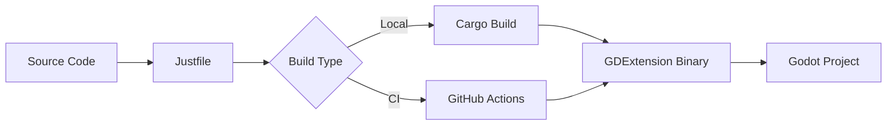
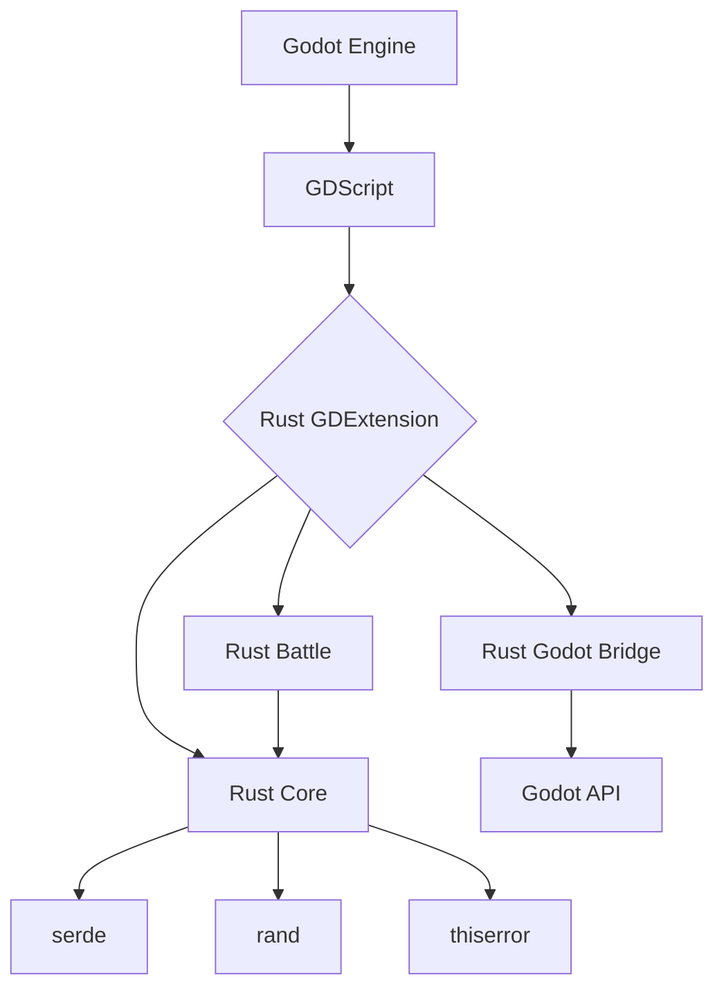

# Deployment Architecture — Phase 1: Toolchain Setup

## 1. Build Pipeline

### 1.1 Local Build

1. Developer runs `just build`
2. `justfile` executes:
   - `cargo build --target wasm32-unknown-unknown`
   - Copies `target/wasm32-unknown-unknown/debug/libxiangke_godot_bridge.dylib` to
     `addons/gdext/libxiangke_godot_bridge.wasm`
   - Updates `addons/gdext/xiangke_godot_bridge.gdextension` with new binary path
3. Developer opens Godot editor to test

### 1.2 CI Build

1. GitHub Actions workflow triggers on `push`
2. Runs:
   - `rustup target add wasm32-unknown-unknown`
   - `cargo build --target wasm32-unknown-unknown --release`
   - `cargo test`
3. Artifacts: `libxiangke_godot_bridge.wasm`, test results

## 2. Release Process

1. **Versioning**: Use `just version` to bump version in `Cargo.toml`
2. **Changelog**: Update `CHANGELOG.md` with changes
3. **Tag**: Create git tag `vX.Y.Z`
4. **Publish**: `cargo publish` (for `core` crate only)

## 3. Runtime Architecture

### 3.1 Web (WASM)

- **Entry Point**: `index.html`
- **Runtime**: Web browser
- **Memory**: WASM linear memory
- **Networking**: WebSockets, HTTP fetch
- **Storage**: `user://` (sandboxed)

### 3.2 Desktop

- **Entry Point**: `xiangke.x86_64`
- **Runtime**: Native OS
- **Memory**: Native heap
- **Networking**: TCP/UDP
- **Storage**: `user://` (local)

## 4. Monitoring

- **Logging**: `tracing` + `tracing-subscriber`
- **Error Reporting**: `anyhow`/`eyre` with backtraces
- **Metrics**: `metrics` crate (future)

## 5. Cost Estimation

- **Development**: $0 (open source tools)
- **Hosting**: $0 (GitHub Pages)
- **CI/CD**: $0 (GitHub Actions free tier)
- **Total**: $0

---

## 6. Summary

The deployment architecture has been designed for:

- **Build Pipeline**: Local (`just`) and CI (GitHub Actions)
- **Release Process**: Semantic versioning, changelog, git tags
- **Runtime Architecture**: Web (WASM) and Desktop
- **Monitoring**: Tracing, error reporting
- **Cost**: $0

All components are ready for implementation.
