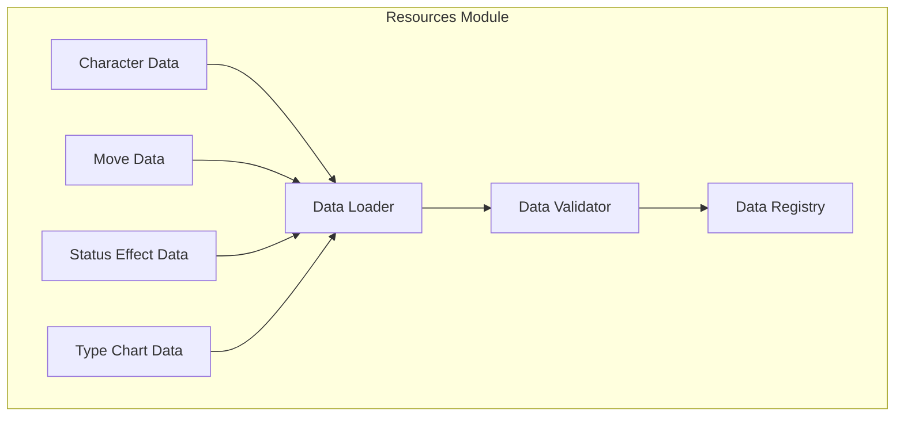
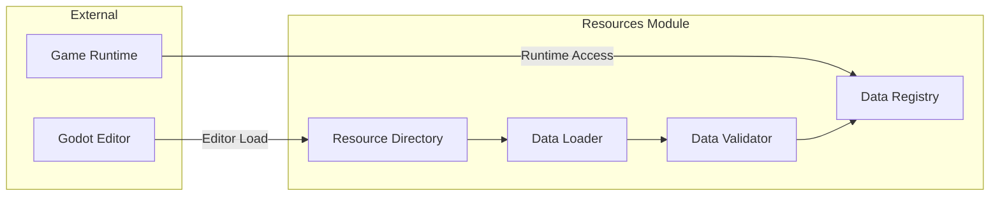
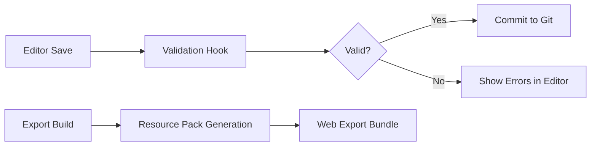

# Unit 3: Resources Module - Infrastructure Design

## Overview

This document defines the infrastructure requirements, architecture, and
deployment strategy for the **Resources Module** (Unit 3) of the xiangke
project.

---

## 1. Infrastructure Requirements

### 1.1 System Dependencies

| Dependency          | Version | Purpose            |
| ------------------- | ------- | ------------------ |
| Godot Engine        | 4.x     | Core game engine   |
| GDScript            | -       | Scripting language |
| Web Export Template | HTML5   | Browser deployment |

### 1.2 External Services (None Required)

The Resources Module operates entirely locally with no external service
dependencies.

---

## 2. Architecture Design

### 2.1 Component Diagram



### 2.2 Data Flow Architecture



---

## 3. Data Storage Strategy

### 3.1 File Organization

```
resources/
├── characters/          # Character resource files (.tres)
│   ├── guan_yu.tres
│   ├── zhou_yu.tres
│   └── zhuge_liang.tres
├── moves/               # Move/skill resource files (.tres)
│   ├── earth_barrier.tres
│   ├── fire_strike.tres
│   ├── flame_burst.tres
│   ├── iron_cleave.tres
│   ├── metal_slash.tres
│   ├── war_cry.tres
│   ├── water_surge.tres
│   └── wood_heal.tres
├── type_chart/          # Type effectiveness data
│   ├── type_enums.gd    # Type definitions
│   └── type_chart.gd    # Effectiveness matrix
├── status_effect/       # Status effect definitions
│   └── status_effect_data.gd
```

### 3.2 Resource Format Specifications

#### Character Resources (.tres)

- **Format**: Godot Scene file with embedded data
- **Required Properties**:
  - `name`: Unique character identifier (e.g., "guan_yu")
  - `title`: Display name (e.g., "Guan Yu")
  - `faction`: Character faction (e.g., "shu", "wu", "shu_alliance")
  - `stats`: Base attribute values
  - `moves`: Array of move identifiers
  - `portrait_path`: Reference to character portrait asset

#### Move Resources (.tres)

- **Format**: Godot Scene file with embedded data
- **Required Properties**:
  - `name`: Unique move identifier (e.g., "fire_strike")
  - `title`: Display name (e.g., "Fire Strike")
  - `type`: Move type (e.g., "fire", "water", "physical")
  - `power`: Base damage/healing value
  - `cooldown`: Cooldown in seconds
  - `description`: Move description text

#### Type Chart Data

- **Format**: GDScript module with static data
- **Structure**:
  ```gdscript
  enum ElementType { fire, water, earth, wind, light, dark }

  # Effectiveness matrix: [attacker_type][defender_type] = multiplier
  const TYPE_CHART: Dictionary = {
      [ElementType.fire]: {
          [ElementType.water]: 2.0,
          [ElementType.earth]: 0.5,
          ...
      },
      ...
  }
  ```

---

## 4. API Design

### 4.1 Data Loader API

```gdscript
# ResourceLoaderExtension.gd
extends ResourceSaver

## Load a character resource by identifier
func load_character(identifier: String) -> CharacterData:
    """
    Loads and validates a character resource.
    
    Args:
        identifier: Unique character identifier (e.g., "guan_yu")
    
    Returns:
        Validated CharacterData instance
    
    Raises:
        ResourceNotFoundError: If the resource doesn't exist
        ValidationError: If the resource fails validation
    """
```

### 4.2 Data Registry API

```gdscript
# DataRegistry.gd
class_name DataRegistry

## Register a new data type with the registry
func register_data_type(type_name: String, schema: Dictionary) -> void:
    """
    Registers a new data type definition.
    
    Args:
        type_name: Unique identifier for the data type
        schema: Data structure definition (JSON-compatible)
    """

## Retrieve registered data by type name
func get_data_type(type_name: String) -> Dictionary:
    """
    Retrieves a registered data type schema.
    
    Args:
        type_name: Registered type identifier
    
    Returns:
        Data type schema dictionary, or null if not found
    """

## Validate data against registered schema
func validate_data(type_name: String, data: Dictionary) -> ValidationResult:
    """
    Validates data structure against a registered schema.
    
    Args:
        type_name: Registered type identifier
        data: Data to validate
    
    Returns:
        ValidationResult with pass/fail status and error messages
    """
```

### 4.3 Data Validator API

```gdscript
# DataValidator.gd
class_name DataValidator

## Validate a single resource file
func validate_resource(resource_path: String) -> ValidationResult:
    """
    Validates a Godot resource file.
    
    Args:
        resource_path: Path to the .tres or .gd file
    
    Returns:
        ValidationResult with validation status and error details
    """

## Batch validate multiple resources
func batch_validate(resource_paths: Array[String]) -> BatchValidationResult:
    """
    Validates multiple resources in parallel.
    
    Args:
        resource_paths: Array of resource file paths
    
    Returns:
        Aggregated validation results with summary statistics
    """
```

---

## 5. Performance Considerations

### 5.1 Memory Management

- **Resource Loading**: Lazy loading on-demand to avoid memory spikes
- **Caching Strategy**: LRU cache for frequently accessed resources (max 10
  entries)
- **Garbage Collection**: Explicit cleanup of unloaded resources in scene
  transitions

### 5.2 Load Time Optimization

| Metric            | Target                 |
| ----------------- | ---------------------- |
| Initial load time | < 50ms                 |
| Subsequent access | < 10ms (cached)        |
| Batch validation  | < 1s for 100 resources |

### 5.3 File I/O Strategy

- Use Godot's `ResourceLoader.load_threaded()` for parallel loading
- Implement progress callbacks for large resource batches
- Pre-load critical resources during scene initialization

---

## 6. Deployment Considerations

### 6.1 Build Pipeline Integration



### 6.2 Web Export Configuration

```json
{
  "export_presets": [
    {
      "name": "Web - Resources Optimized",
      "platform": "Web",
      "options": {
        "resource_compression": true,
        "preload_resources": ["characters/*", "moves/*"],
        "lazy_load_remaining": true
      }
    }
  ]
}
```

### 6.3 CDN Considerations (Future)

- Resource files are currently bundled with the Godot export
- Future iterations may consider:
  - Separate resource hosting on CDN
  - Versioned URLs for cache busting
  - Progressive loading strategies

---

## 7. Security Considerations

### 7.1 Data Integrity

- All resources are loaded from trusted sources (local file system)
- No external network calls during runtime
- Schema validation prevents injection attacks

### 7.2 Content Moderation

- Resource files are validated against schema before loading
- Malformed or malicious resources are rejected with clear error messages
- Editor-only operations require proper authentication in CI/CD pipelines

---

## 8. Monitoring and Observability

### 8.1 Metrics to Track

| Metric                   | Threshold | Action          |
| ------------------------ | --------- | --------------- |
| Resource load time       | > 100ms   | Log warning     |
| Validation failures      | > 5/min   | Alert developer |
| Memory usage (resources) | > 200MB   | Consider unload |

### 8.2 Logging Strategy

```gdscript
class_name ResourceManagerLogger

func log_resource_load(identifier: String, duration_ms: int, success: bool):
    if success:
        print(f"[RES] Loaded {identifier} in {duration_ms}ms")
    else:
        error_log(f"[RES] Failed to load {identifier}")

func log_validation_failure(resource_path: String, errors: Array):
    warn_log(f"[VAL] Validation failed for {resource_path}:\n  - {errors.join('\n  - ')}")
```

---

## 9. Infrastructure Diagram

```mermaid
flowchart TB
    subgraph "Development Environment"
        ED["Godot Editor"] -->|Resource Save| RD[("Resource Files"])
        ED -->|Validation Hook| DV["Data Validator"]
        DV -->|Schema Check| DR["Data Registry"]
    end

    subgraph "Runtime Environment"
        G["Game Runtime"] -->|Load Request| DL["Data Loader"]
        DL -->|Threaded Load| RD
        DL -->|Validation| DV
        DV -->|Cache Result| DR
        DR -->|Provide Data| GS["Game Systems"]
    end

    subgraph "Build Environment"
        BE["CI/CD Pipeline"] -->|Validate All| DV
        DV -->|Batch Validate| RD
        BE -->|Generate Preset| EP[("Export Preset")]
    end
```

---

## 10. Implementation Checklist

- [ ] Define resource schemas for each data type
- [ ] Implement DataLoader with threaded loading
- [ ] Implement DataValidator with schema validation
- [ ] Implement DataRegistry for centralized access
- [ ] Create ResourceLoaderExtension for editor integration
- [ ] Set up validation hooks in Godot project settings
- [ ] Document resource file format specifications
- [ ] Create migration guide for existing resources
- [ ] Implement LRU caching strategy
- [ ] Add performance monitoring and logging

---

## 11. Rollback Plan

If issues arise during deployment:

1. **Immediate**: Revert to previous Godot project version via Git
2. **Short-term**: Disable new resource loading in runtime config
3. **Long-term**: Implement gradual rollout with feature flags

---

## Approval

**Infrastructure Design Complete.** Ready for Code Generation phase.
