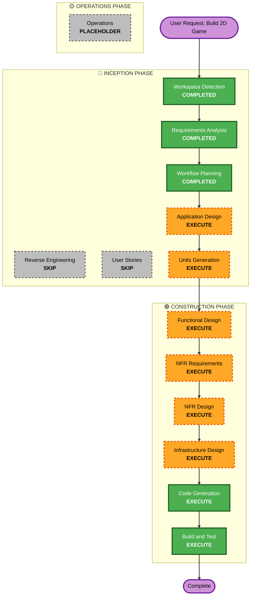

# Execution Plan

## Detailed Analysis Summary

### Transformation Scope

- **Transformation Type**: New Project (Greenfield)
- **Primary Changes**: Complete 2D game development with AI, UI, audio, and
  database integration
- **Related Components**: N/A (new project)

### Change Impact Assessment

- **User-facing changes**: Yes — game is playable via Web (HTML5)
- **Structural changes**: Yes — new Godot project with multiple scene/node
  systems
- **Data model changes**: Yes — player data, leaderboard schemas
- **API changes**: Yes — database API for persistence
- **NFR impact**: Yes — performance (FPS), compatibility (browsers), security
  (data handling)

### Risk Assessment

- **Risk Level**: Medium
- **Rollback Complexity**: Easy (greenfield, no production systems)
- **Testing Complexity**: Moderate (game AI, web export, database integration)

## Workflow Visualization

## Phases to Execute

### 🔵 INCEPTION PHASE

- [x] Workspace Detection (COMPLETED)
- [x] Reverse Engineering (SKIPPED — greenfield project)
- [x] Requirements Analysis (COMPLETED)
- [x] User Stories (SKIPPED — internal tool, single user)
- [x] Workflow Planning (COMPLETED)
- [ ] Application Design — **EXECUTE**
  - **Rationale**: New game project requires component design (game systems,
    scenes, nodes, AI behavior patterns)
- [ ] Units Generation — **EXECUTE**
  - **Rationale**: Complex project with multiple systems (AI, UI, Audio,
    Database) requires structured unit decomposition

### 🟢 CONSTRUCTION PHASE

- [ ] Functional Design — **EXECUTE**
  - **Rationale**: Complex game logic (AI behaviors, game mechanics, UI
    interactions) needs detailed design
- [ ] NFR Requirements — **EXECUTE**
  - **Rationale**: Performance (FPS in browser), compatibility (web export), and
    security (database) requirements exist
- [ ] NFR Design — **EXECUTE**
  - **Rationale**: NFR requirements need corresponding design patterns
- [ ] Infrastructure Design — **EXECUTE**
  - **Rationale**: Database integration and Web export deployment need
    infrastructure specification
- [ ] Code Generation — **EXECUTE** (ALWAYS)
  - **Rationale**: Full game implementation with GDScript
- [ ] Build and Test — **EXECUTE** (ALWAYS)
  - **Rationale**: Build, export to Web, and verify all systems

### 🟡 OPERATIONS PHASE

- [ ] Operations — PLACEHOLDER
  - **Rationale**: Future deployment and monitoring workflows

## Estimated Timeline

- **Total Stages**: 10 (excluding skipped/placeholder)
- **Estimated Duration**: Multi-week project (complex game with AI, database,
  web export)

## Success Criteria

- **Primary Goal**: Playable 2D game running in browser (HTML5 export)
- **Key Deliverables**:
  - Godot 4.x project with complete GDScript codebase
  - AI/NPC behavior system
  - UI/HUD system
  - Audio system (BGM + SFX)
  - Database integration (player data, leaderboards)
  - Web (HTML5) export working in modern browsers
- **Quality Gates**:
  - Stable frame rate (≥30 FPS) in browser
  - All core gameplay features functional
  - Database read/write working correctly
  - Clean project structure following Godot conventions
