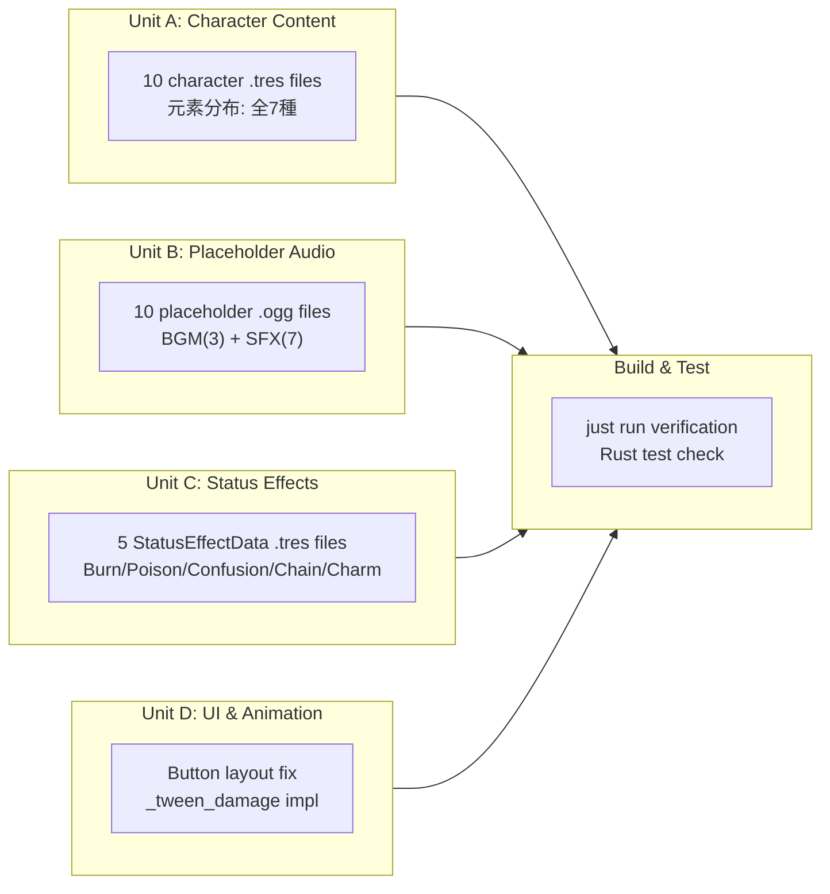

# Workflow Plan — Fix Unimplemented Features

**Based on**: `fix-run-project-requirements.md` **Date**: 2026-07-26 **Risk
Level**: Low

## Phase Determination

| Stage               | Decision | Rationale                                  |
| ------------------- | -------- | ------------------------------------------ |
| Reverse Engineering | ❌ SKIP  | Existing architecture fully documented     |
| User Stories        | ❌ SKIP  | Internal content/UI fixes, no new features |
| Application Design  | ❌ SKIP  | Architecture unchanged                     |
| Units Generation    | ❌ SKIP  | Units already defined in requirements      |

## Execution Plan

## Units

### Unit A: Character Content — 10 new `.tres` files

- Design 10 new characters with balanced stats
- Cover all 7 element types
- Assign existing moves from the 8 available
- Create files in `resources/characters/`

### Unit B: Placeholder Audio — 10 `.ogg` files

- Create valid silent/short OGG files
- BGM directory: `audio/bgm/` (3 files)
- SFX directory: `audio/sfx/` (7 files)

### Unit C: Status Effects — 5 `.tres` files

- Burn: damage_per_turn=0.125, escalating=false
- Poison: damage_per_turn=0.1, escalating=true, max_damage_cap=0.25
- Confusion: self-attack effect
- Chain: linked damage effect
- Charm: attack reduction (stat_mod_multiplier=0.5)

### Unit D: UI & Animation

- Fix ConfirmCorps/Deploy button positions in `character_select.tscn`
- Implement `_tween_damage()` in `battle_scene.gd`

### Build & Test

- Run `just run` to verify no errors
- Confirm `cargo test` still passes
- Verify game flow: Title → Character Select → Battle → Result
