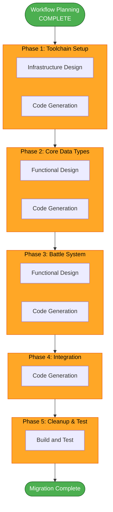

# Migration Execution Plan — GDScript to Rust

## 1. Detailed Scope and Impact Analysis

### 1.1 Transformation Scope

| Dimension          | Assessment                                                                                                  |
| ------------------ | ----------------------------------------------------------------------------------------------------------- |
| **Type**           | Architectural Transformation — new runtime (Rust GDExtension) alongside existing Godot engine               |
| **Infrastructure** | New: Rust toolchain, Cargo workspace, GDExtension build system. Existing: Godot project structure unchanged |
| **Deployment**     | Same (Web WASM + Desktop), but with additional Rust compilation step                                        |

### 1.2 Component Relationships

- **Primary Component (to migrate)**: Battle system (`systems/battle/`) + Core
  data types (`scripts/type_enums.gd`, `type_chart.gd`, `character_data.gd`,
  `move_data.gd`, `status_effect_data.gd`)
- **Shared Interfaces**: Godot signals and method calls between Rust GDExtension
  and GDScript scenes/autoloads
- **Dependent Components**: `battle_scene.gd` (calls battle system),
  `data_registry.gd` (provides data to battle system)
- **Unchanged Components**: All autoloads (`GameManager`, `SaveManager`,
  `AudioManager`, `UIFocusManager`), all scenes (`.tscn`), all resources
  (`.tres`)

### 1.3 Change Impact Assessment

| Area               | Impact   | Details                                                                                             |
| ------------------ | -------- | --------------------------------------------------------------------------------------------------- |
| **User-facing**    | None     | Game looks and feels identical; same scenes, same UI                                                |
| **Structural**     | Medium   | New `rust/` Cargo workspace added; GDScript battle files replaced with thin wrappers                |
| **Data model**     | Low      | Rust structs mirror existing GDScript resource types; .tres files remain unchanged                  |
| **API/Interfaces** | Medium   | Godot signals between scene and battle system must be preserved                                     |
| **NFR**            | Positive | Performance gains from native Rust; type safety eliminates runtime errors                           |
| **Build**          | Medium   | Added `cargo build` step + GDExtension compilation; Godot export must include `.gdextension` binary |

### 1.4 Risk Assessment

**Risk Level: Medium**

| Risk                             | Likelihood | Mitigation                                               |
| -------------------------------- | ---------- | -------------------------------------------------------- |
| gdext WASM target compatibility  | Medium     | Verify early in Phase 1; have Desktop fallback           |
| GDScript-Rust interop complexity | Medium     | Keep interface layer thin; use simple types              |
| Godot version compatibility      | Low        | Use stable godot-rust matching Godot 4.x                 |
| Migration breaks existing game   | Low        | Incremental approach; GDScript version always functional |

---

## 2. Phase Determination

| Phase                  | Decision    | Rationale                                                                                                                                                                               |
| ---------------------- | ----------- | --------------------------------------------------------------------------------------------------------------------------------------------------------------------------------------- |
| **User Stories**       | ❌ **SKIP** | Migration project; no new user-facing features. Internal technology change.                                                                                                             |
| **Application Design** | ❌ **SKIP** | Existing architecture (components, services, scenes) is unchanged. We are reimplementing behind the same interfaces. Godot-rust integration pattern will be covered in Code Generation. |
| **Units Generation**   | ❌ **SKIP** | Migration phases are already defined in requirements (MS-2.1 through MS-2.5). No further decomposition needed.                                                                          |

### Construction Phase — Per-Unit Loop

The migration is organized into 5 sequential units (following MS-2 phases). Each
unit goes through applicable design + code generation stages.

---

## 3. Workflow Visualization



### Text Alternative

```
Phase 1: Toolchain Setup
  → Infrastructure Design (Rust + gdext setup)
  → Code Generation (Cargo project, gdext skeleton)
Phase 2: Core Data Types
  → Functional Design (Rust type mappings)
  → Code Generation (type_enums, type_chart, char/move/status data in Rust)
Phase 3: Battle System
  → Functional Design (Rust battle architecture)
  → Code Generation (participant, state, action, manager, flow service in Rust)
Phase 4: Integration
  → Code Generation (GDScript wrappers, signal wiring, battle_scene update)
Phase 5: Cleanup & Test
  → Build and Test (remove old GDScript, WASM export, performance verification)
```

---

## 4. Execution Details

### Unit 1: Toolchain Setup

**Stages to execute:**

- **Infrastructure Design** (CONDITIONAL — YES): Design the Rust toolchain,
  Cargo workspace structure, gdext build pipeline, Godot project integration
- **Code Generation** (ALWAYS): Create `rust/` directory, `Cargo.toml`, gdext
  skeleton, build scripts, `.gdextension` file

### Unit 2: Core Data Types

**Stages to execute:**

- **Functional Design** (CONDITIONAL — YES): Design Rust enums/structs to
  replace GDScript type definitions and resources
- **Code Generation** (ALWAYS): Implement `TypeElement`, `TypeChart`,
  `CharacterData`, `MoveData`, `StatusEffectData` in Rust

### Unit 3: Battle System

**Stages to execute:**

- **Functional Design** (CONDITIONAL — YES): Design Rust battle system
  architecture — ownership model, trait definitions, error handling strategy
- **Code Generation** (ALWAYS): Implement `BattleParticipant`, `BattleState`,
  `ActionSystem`, `BattleManager`, `BattleFlowService` in Rust

### Unit 4: Integration

**Stages to execute:**

- **Code Generation** (ALWAYS): Create thin GDScript wrappers that call Rust
  GDExtension, update `battle_scene.gd` to use Rust battle system, wire signals

### Unit 5: Cleanup & Test

**Stages to execute:**

- **Build and Test** (ALWAYS): Remove migrated GDScript files, run full Godot
  project validation, WASM export test, performance benchmark comparison

---

## 5. Module Update Strategy

| Unit                  | Dependencies           | Parallelizable | Priority      |
| --------------------- | ---------------------- | -------------- | ------------- |
| **1: Toolchain**      | None                   | No             | Must-go-first |
| **2: Data Types**     | Unit 1                 | No             | Sequential    |
| **3: Battle System**  | Unit 1, Unit 2         | No             | Sequential    |
| **4: Integration**    | Unit 1, Unit 2, Unit 3 | No             | Sequential    |
| **5: Cleanup & Test** | All above              | No             | Last          |

**Update Approach**: Sequential (each phase depends on the previous) **Critical
Path**: Unit 1 → Unit 2 → Unit 3 → Unit 4 → Unit 5 **Coordination Points**:
Rust-GDScript interface contracts (signal signatures, method names, data
formats) **Testing Checkpoints**: After Unit 2 (unit test Rust types), After
Unit 3 (unit test battle logic), After Unit 4 (integration test in Godot)
